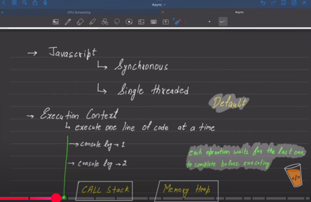
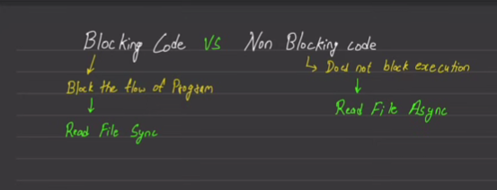
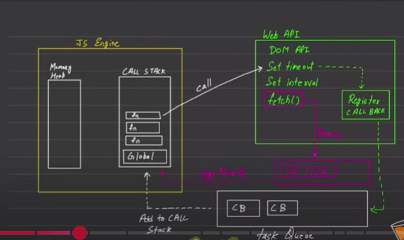

<!-- javascript is synchronous and single threaded language -->

<!-- line execute one by one . Each operation wait for the last one to complete before executing-->

<!-- which code is good Blocking or Non Blocking (depends on the usecase) -->

 
